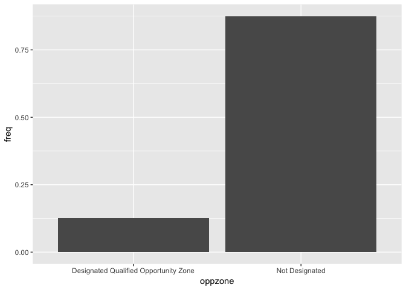
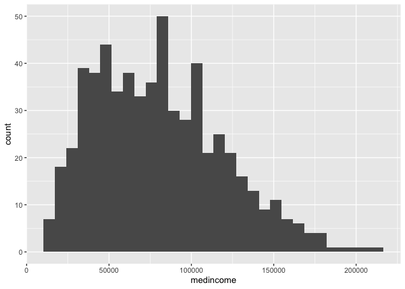
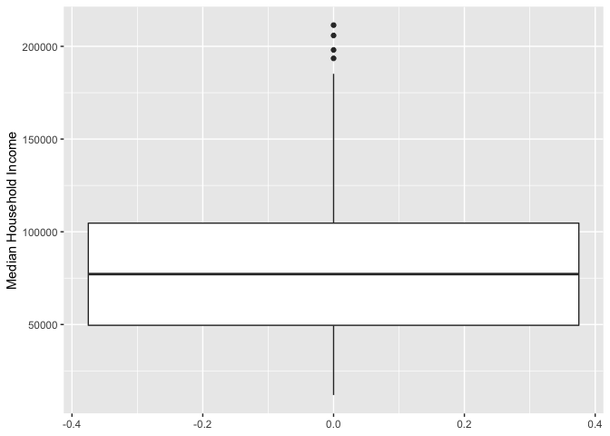
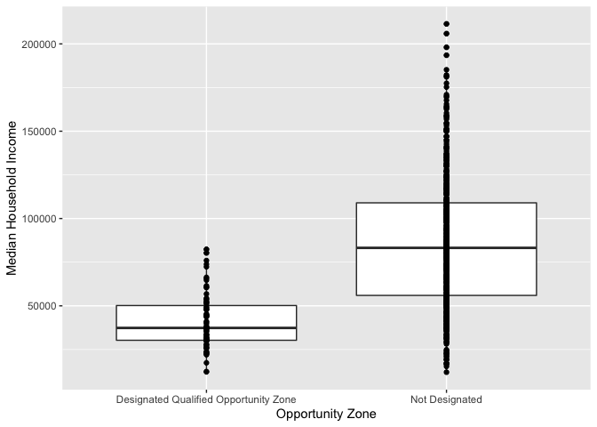

<style>
p.comment {
background-color: #DBDBDB;
padding: 10px;
border: 1px solid black;
margin-left: 25px;
border-radius: 5px;
font-style: italic;
}

.figure {
   margin-top: 30px;
   margin-bottom: 30px;
}

h1.title {
  font-weight: bold;
}

</style>
\


In [Lab 2](https://crd150.github.io/lab2.html), we worked with county-level data.  That is, the rows or units of observations in our data set represented counties.  In this lab, we will be working with neighborhood data, using census tracts to represent neighborhoods.  Specifically, you will learn how to use descriptive statistics and graphs to describe neighborhoods using R. The data were downloaded from [PolicyMap](https://ucdavis.policymap.com/maps).  The objectives of the guide are as follows

1. Get familiar with PolicyMap neighborhood data
2. Learn how to use various R functions to summarize neighborhood characteristics
3. Introduction to R graphics


This lab guide follows closely and supplements the material presented in Chapters 1,5 and 22 in the textbook [R for Data Science](http://r4ds.had.co.nz/index.html) (RDS).

<p class="comment", style="font-style:normal">**Assignment 3 is due by 12:00 am, October 19th on Canvas.**  See [here](https://crd150.github.io/hw_guidelines.html) for assignment guidelines.  You must submit an `.Rmd` file and its associated `.html` file. Name the files: yourLastName_firstInitial_asgn03. For example: brazil_n_asgn03.</p>

<div style="margin-bottom:25px;">
</div>
## **Open up a new R Markdown file**
\

As you did in Lab 2 and will do for all Labs, save and run all the code from this guide from your own R Markdown document. To open a new R Markdown file, click on *File* at the top menu in RStudio, select *New File*, and then *R Markdown*. A window should pop up. In that window, for *Title*, put in "Lab 3".  For *Author*, put your name. Leave the HTML radio button clicked, and select OK.  A new R Markdown file should pop up in the top left window.  Don't change anything inside the YAML (the stuff at the top in between the `---`).  Also keep the grey chunk after the YAML.

````
```{r setup, include=FALSE}
knitr::opts_chunk$set(echo = TRUE)
```
````

Delete everything else. Save this file (File -> Save) in an appropriate folder. 

<div style="margin-bottom:25px;">
</div>
## **Reading in census tract data**
\

You will be working with census tract data for the cities of Sacramento, San Francisco, San Jose, and Oakland, the four largest cities in Northern California.  Let's get some practice working with data from PolicyMap, which provides Census data along with other cool and interesting neighborhood data.  

Unlike the Census, PolicyMap does not have a user-friendly R package for downloading their data through an API.  To save us time, I downloaded data from PolicyMap, cleaned the file, and uploaded it on GitHub. Let's bring the csv file into R using `read_csv()`, which comes from the **tidyverse** package, which we need to load in. 


```r
library(tidyverse)
ncal.tracts <- read_csv("https://raw.githubusercontent.com/crd150/data/master/pmap_lab3.csv")
ncal.tracts
```

The dataset contains tract-level median household income, percent Hispanic, percent Black, whether the tract is designated as an [Opportunity Zone](http://dof.ca.gov/Forecasting/Demographics/opportunity_zones/) (a high-poverty neighborhood eligible for federal economic development funding), the home mortgage loan-to-income ratio (also known as the leverage ratio), and whether the tract is "Majority" Hispanic (*phisp* > 50%) or "Not Majority" Hispanic.  In putting this data file together, data wrangling was fairly extensive.  I've uploaded a [tutorial](https://crd150.github.io/policymap.html) describing the steps for downloading and cleaning these data. You won't need to go through the tutorial to complete this guide and Assignment 3, but please look through it at some point as it provides some important data wrangling functions that will be relevant for your final project, especially if you are planning to use PolicyMap.

<div style="margin-bottom:25px;">
</div>
## **Summarizing a single variable**
\

Recall from Week 2 lecture our two important data types: categorical and numeric. Let's first summarize a numeric variable - neighborhood median household income - using some basic descriptive statistics.

<div style="margin-bottom:25px;">
</div>
### **Numeric variable**
\

We use the function `summarize()` to calculate mean neighborhood income.  The first argument inside `summarize()` is the data object *ncal.tracts* and the second argument is the function calculating the specific summary statistic, in this case `mean()`.


```r
summarize(ncal.tracts, mean(medincome))
```

```
## # A tibble: 1 x 1
##   `mean(medincome)`
##               <dbl>
## 1            80309.
```

Does the average neighborhood income differ by city?  We need to pair `summarize()` with the function `group_by()` to answer this question.  The function `group_by()` tells R to run subsequent functions on the data object *by* a group characteristic (such as gender, educational attainment, or in this case, city).


```r
ncal.tracts %>%
  group_by(city) %>%
  summarize(mean(medincome))
```

```
## # A tibble: 4 x 2
##   city          `mean(medincome)`
##   <chr>                     <dbl>
## 1 Oakland                  66706.
## 2 Sacramento               53562.
## 3 San Francisco            90985.
## 4 San Jose                 91464.
```

The above code uses the pipe operator `%>%`, which was first introduced in Lab 2. The utility of `%>%` is that it executes tasks on the same dataset using one line of continuous code. The first pipe sends *ncal.tracts* into the function *group_by()*, which tells R to group *ncal.tracts* by the variable *city*.  


```r
ncal.tracts %>%
  group_by(city)
```

How do you know the tibble is grouped? Because it tells you 

<center>


</center>

The second pipe takes this grouped dataset and sends it into the `summarize()` command, which calculates the mean neighborhood income (by city, because the dataset is grouped by city).

We can calculate more than one summary statistic within `summarize()`.  For example, to get the mean, median, standard deviation and interquartile range (IQR) of median income, and give column labels for the variables in the resulting summary table, we type in


```r
ncal.tracts %>%
  group_by(city) %>%
  summarize(incmn = mean(medincome),
            incmd = median(medincome),
            incsd = sd(medincome),
            inciqr = IQR(medincome))
```

```
## # A tibble: 4 x 5
##   city           incmn  incmd  incsd inciqr
##   <chr>          <dbl>  <dbl>  <dbl>  <dbl>
## 1 Oakland       66706. 51691  41262. 42011 
## 2 Sacramento    53562. 48696. 24405. 28392.
## 3 San Francisco 90985. 88929  38443. 50490 
## 4 San Jose      91464. 87917  34637. 48539
```


Remember from lecture that the IQR is the difference between the 75th and 25th percentiles.  It is a measure of spread, and more generally, an indicator of inequality.  Another measure of neighborhood inequality is the 90/10 ratio. To calculate this ratio, we'll first need to calculate the 90th and 10th percentiles using the `quantile()` command. We can do all of this inside `summarize()`. 


```r
ncal.tracts %>%
  group_by(city) %>%
  summarize(incmn = mean(medincome),
            incmd = median(medincome),
            incsd = sd(medincome),
            inciqr = IQR(medincome),
            p90 = quantile(medincome, p = 0.90),
            p10 = quantile(medincome, p = 0.10),
            r90.10 = p90/p10) %>%
  select(-(c(p90,p10)))
```

```
## # A tibble: 4 x 6
##   city           incmn  incmd  incsd inciqr r90.10
##   <chr>          <dbl>  <dbl>  <dbl>  <dbl>  <dbl>
## 1 Oakland       66706. 51691  41262. 42011    4.38
## 2 Sacramento    53562. 48696. 24405. 28392.   3.14
## 3 San Francisco 90985. 88929  38443. 50490    3.56
## 4 San Jose      91464. 87917  34637. 48539    2.74
```


<div style="margin-bottom:25px;">
</div>
### **Categorical variable**
\

Let's next summarize a categorical variable.  *oppzone* indicates whether a tract is designated as an Opportunity Zone neighborhood. To get the percent of tracts that are Opportunity Zone neighborhoods, you'll need to combine the functions `group_by()`, `summarize()` and `mutate()` using `%>%`.


```r
ncal.tracts %>%
  group_by(oppzone) %>%
  summarize(n = n()) %>%
  mutate(freq = n / sum(n))
```

```
## # A tibble: 2 x 3
##   oppzone                                   n  freq
##   <chr>                                 <int> <dbl>
## 1 Designated Qualified Opportunity Zone    75 0.125
## 2 Not Designated                          524 0.875
```

Let's break up this chunk of code to show exactly what was done here. First, `group_by(oppzone)` separates the neighborhoods by Opportunity Zone designation. We then used `summarize()` to count the number of neighborhoods by Opportunity Zone designation.  The function to get a count is `n()`, and we saved this count in a variable named *n*. This gives us the following table.


```r
ncal.tracts %>%
  group_by(oppzone) %>%
  summarize (n = n())
```

```
## # A tibble: 2 x 2
##   oppzone                                   n
##   <chr>                                 <int>
## 1 Designated Qualified Opportunity Zone    75
## 2 Not Designated                          524
```

Next, we used `mutate()` on this table to get the proportion of all neighborhoods by Opportunity Zone designation. The code `sum(n)` adds the values of *n*:  524+75 = 599. We then divide the value of each *n* by this sum:  75/599 = 0.125 and 524/599 = 0.875. That yields the final frequency table. 


```r
ncal.tracts %>%
  group_by(oppzone) %>%
  summarize (n = n()) %>%
  mutate(freq = n / sum(n))
```

```
## # A tibble: 2 x 3
##   oppzone                                   n  freq
##   <chr>                                 <int> <dbl>
## 1 Designated Qualified Opportunity Zone    75 0.125
## 2 Not Designated                          524 0.875
```

  

We can add *city* to the `group_by()` function to disaggregate by city.  


```r
ncal.tracts %>%
  group_by(city, oppzone) %>%
  summarize (n = n()) %>%
  mutate(freq = n / sum(n))
```

```
## # A tibble: 8 x 4
## # Groups:   city [4]
##   city          oppzone                                   n   freq
##   <chr>         <chr>                                 <int>  <dbl>
## 1 Oakland       Designated Qualified Opportunity Zone    30 0.265 
## 2 Oakland       Not Designated                           83 0.735 
## 3 Sacramento    Designated Qualified Opportunity Zone    23 0.23  
## 4 Sacramento    Not Designated                           77 0.77  
## 5 San Francisco Designated Qualified Opportunity Zone    11 0.0558
## 6 San Francisco Not Designated                          186 0.944 
## 7 San Jose      Designated Qualified Opportunity Zone    11 0.0582
## 8 San Jose      Not Designated                          178 0.942
```
 
Which city has the highest proportion of Opportunity Zone neighborhoods? Lowest? 

<div style="margin-bottom:25px;">
</div>
## **Summarizing two variables**
\

The functions we've gone through so far describe **one** variable. It is often the case that we are interested in understanding whether two community variables are associated with one another. 

Let's go through the ways we can describe the association between: (1) two categorical variables; (2) one categorical variable and one numeric variable; (3) two numeric variables.

<div style="margin-bottom:25px;">
</div>
### **Two categorical variables**
\

To summarize the relationship between two categorical variables, you'll need to find the proportion of observations for each combination, also known as a cross tabulation. Let's create a cross tabulation of the categorical variables *oppzone* and *mhisp*. 


```r
ncal.tracts %>%
  group_by(oppzone, mhisp) %>%
  summarize(n = n())  %>%
  mutate(freq = n / sum(n))
```

```
## # A tibble: 4 x 4
## # Groups:   oppzone [2]
##   oppzone                               mhisp            n   freq
##   <chr>                                 <chr>        <int>  <dbl>
## 1 Designated Qualified Opportunity Zone Majority        16 0.213 
## 2 Designated Qualified Opportunity Zone Not Majority    59 0.787 
## 3 Not Designated                        Majority        47 0.0897
## 4 Not Designated                        Not Majority   477 0.910
```

A much higher proportion of Opportunity Zone neighborhoods are Majority Hispanic compared to non Opportunity Zone neighborhoods.

<div style="margin-bottom:25px;">
</div>
### **One categorical, one numeric**
\

A typical way of summarizing the relationship between a categorical variable and a numeric variable is by taking the mean of the continuous variable for each level of the categorical variable. The variable *oppzone* is categorical with two categories (designated and not designated as an Opportunity Zone) and we can get the mean loan-to-income ratio for each of these categories.


```r
ncal.tracts %>%
  group_by(oppzone) %>%
  summarize("Mean levratio" = mean(levratio))
```

```
## # A tibble: 2 x 2
##   oppzone                               `Mean levratio`
##   <chr>                                           <dbl>
## 1 Designated Qualified Opportunity Zone            3.45
## 2 Not Designated                                   3.36
```

Let's separate by city by adding *city* to the `group_by()` function.


```r
ncal.tracts %>%
  group_by(city, oppzone) %>%
  summarize("Mean levratio" = mean(levratio))
```

```
## # A tibble: 8 x 3
## # Groups:   city [?]
##   city          oppzone                               `Mean levratio`
##   <chr>         <chr>                                           <dbl>
## 1 Oakland       Designated Qualified Opportunity Zone            3.46
## 2 Oakland       Not Designated                                   3.30
## 3 Sacramento    Designated Qualified Opportunity Zone            3.20
## 4 Sacramento    Not Designated                                   2.99
## 5 San Francisco Designated Qualified Opportunity Zone            3.82
## 6 San Francisco Not Designated                                   3.36
## 7 San Jose      Designated Qualified Opportunity Zone            3.54
## 8 San Jose      Not Designated                                   3.53
```

Any city stick out?

<div style="margin-bottom:25px;">
</div>
### **Two numeric variables**
\

You can summarize the relationship between two numeric variables with the correlation coefficient.  To calculate the correlation coefficient, use the function `cor()`.  The first two arguments in `cor()` are the two numeric variables you want to calculate the correlation. Let's calculate the correlation between neighborhood income and percent race, and neighborhood loan-to-income ratio and percent race.  Group these correlations by city.


```r
ncal.tracts %>%
  group_by(city) %>%
  summarize(hisp_ratio = cor(levratio,phisp), 
            blk_ratio = cor(levratio,pblk),
            hisp_inc = cor(medincome,phisp),
            blk_inc = cor(medincome,pblk))
```

```
## # A tibble: 4 x 5
##   city          hisp_ratio blk_ratio hisp_inc blk_inc
##   <chr>              <dbl>     <dbl>    <dbl>   <dbl>
## 1 Oakland            0.607     0.269   -0.468  -0.488
## 2 Sacramento         0.410     0.411   -0.544  -0.484
## 3 San Francisco      0.337     0.194   -0.309  -0.344
## 4 San Jose           0.607    -0.221   -0.693  -0.229
```


<div style="margin-bottom:25px;">
</div>
## **Summarizing variables using graphs**
\

Another way of summarizing neighborhood variables and their relationships is through graphs and charts.  The main package for R graphing is **ggplot2** which is a part of the **tidyverse** package.  The graphing function is `ggplot()` and it takes on the basic template

````
ggplot(data = <DATA>) +
      <GEOM_FUNCTION>(mapping = aes(x, y))
````

* `ggplot()` is the base function where you specify your dataset using the `data = <DATA>` argument.  
* You then need to build on this base by using the plus operator `+` and `<GEOM_FUNCTION>()` where `<GEOM_FUNCTION>()` is a unique function indicating the type of graph you want to plot. For example, the `<GEOM_FUNCTION>()` for a histogram is `geom_histogram()`.
* Each unique function has its unique set of mapping arguments which you specify using the `mapping = aes()` argument.  Charts and graphs have an x-axis, y-axis, or both.  

<div style="margin-bottom:25px;">
</div>
### **Bar charts**
\

We use bar charts to summarize categorical variables.  Bar charts show either the number or frequency of each category.  To create a bar chart, use `geom_bar()` for `<GEOM_FUNCTION>()`.  Let's show a bar chart of *oppzone*. We can borrow from the code we used earlier to create our *oppzone* frequency table and pipe this table directly into `ggplot()`.  


```r
ncal.tracts %>% 
  group_by(oppzone) %>%
  summarize (n = n()) %>%
  mutate(freq = n / sum(n))  %>%
  ggplot() +
    geom_bar(mapping=aes(x=oppzone, y=freq),stat="identity") 
```

<!-- -->
    
We didn't need to specify `data = <DATA>` in `ggplot()` because it was piped in.  Within `aes()`, we specified the categorical variable *oppzone* on the x-axis and then the proportion of neighborhoods *freq* on the y-axis.  The argument `stat = "identity"` tells `ggplot()` to plot the exact value listed for the variable *freq*.  

The X and Y axes labels are not so great.  We can relabel the axes using the `xlab()` and `ylab()` functions. 


```r
ncal.tracts %>% 
  group_by(oppzone) %>%
  summarize (n = n()) %>%
  mutate(freq = n / sum(n))  %>%
  ggplot() +
    geom_bar(mapping=aes(x=oppzone, y=freq),stat="identity") +
    xlab("Opportunity Zone") +
    ylab("Proportion")
```

<!-- -->
    
We can also show a cross tabulation of two categorical variables using a bar chart.  Let's take the earlier code used to create the cross tabulation of Opportunity Zone and Majority/Not Majority Hispanic and pipe that into `ggplot()`


```r
ncal.tracts %>% 
  group_by(oppzone, mhisp) %>%
  summarize(n = n())  %>%
  mutate(freq = n / sum(n)) %>%
  ggplot() +
    geom_bar(mapping=aes(x=oppzone,y=freq,fill=mhisp), position="dodge",stat="identity") +
    xlab("Opportunity Zone") +
    ylab("Frequency") +
    labs(fill="Hispanic Population") 
```

<!-- -->

The only real difference between the code to create this chart and the code to create the single variable bar chart is that you add the second categorical variable *mhisp* into the argument `fill=` within `aes()`.  The argument `position="dodge"` puts the bars side-by-side rather than stacked (take out `position="dodge"` from the above code and see what a stacked bar chart looks like). The above code also changes the legend title using the function `labs()`. As we went through in lecture, you can add a title, subtitle and footnotes using the `labs()` function.


<div style="margin-bottom:25px;">
</div>
### **Histograms**
\

Histograms are used to summmarize a single numeric variable.  To create a histogram, use `geom_histogram()` for `<GEOM_FUNCTION()>`.  Let's create a histogram of median household income.


```r
ncal.tracts %>% 
  ggplot() + 
  geom_histogram(mapping = aes(x=medincome))
```

```
## `stat_bin()` using `bins = 30`. Pick better value with `binwidth`.
```

<!-- -->


Because a single variable is plotted on the x-axis, we specify `x =` in `aes()` but not a `y = `.   The message tells us that we can use the `bins =` argument to change the number of bins used to produce the histogram.  You can increase the number of bins to make the bins narrower and thus get a finer grain of detail.  Let's increase the number of bins from 30 (the default) to 50.


```r
ncal.tracts %>% 
  ggplot() + 
  geom_histogram(mapping = aes(x=medincome), bins = 50)
```

<!-- -->

Or you can decrease the number of bins to get a broader visual summary of the shape of the variable's distribution. Let's decrease the number of bins to 10.


```r
ncal.tracts %>% 
  ggplot() + 
  geom_histogram(mapping = aes(x=medincome), bins = 10)
```

<!-- -->

<div style="margin-bottom:25px;">
</div>
### **Boxplots**
\

We can use a boxplot to visually summarize the distribution of a single variable or the relationship between a categorical and numeric variable.  Use `geom_boxplot()` for `<GEOM_FUNCTION()>` to create a boxplot.  Let's examine median household income.   


```r
ncal.tracts %>%
  ggplot() +
     geom_boxplot(mapping = aes(y = medincome))
```

<!-- -->

Remember from the week's readings that the points oustide the whiskers represent outliers. Outliers are defined as having values that are either larger than the 75th percentile plus 1.5 times the IQR or smaller than the 25th percentile minus 1.5 times the IQR.  The IQR is $55,103, the 75th percentile is $104,670 and the 25th percentile is $49,568.  While we don't see outliers at the bottom, we do see outliers at the top - these are neighborhoods with median income values greater than $104,670 + 1.5*$55,103 = $187,324.5

Let's examine the distribution of median income by Opportunity Zone. Because we are examining the association between two variables, we need to specify *x* **and** *y* variables.  


```r
ncal.tracts %>%
  ggplot() +
    geom_boxplot(mapping = aes(x = oppzone, y = medincome)) 
```

<!-- -->

The boxplot is for all neighborhoods combined.  Use the `facet_wrap()`function to separate by city      
        

```r
ncal.tracts %>%
  ggplot() +
  geom_boxplot(mapping = aes(x = oppzone, y = medincome)) +
  facet_wrap(~city) 
```

<!-- -->

Note the tilde operator `~` before city.  

The labels for *oppzone* is really long.  We can change the label or we can create horizontal boxplots.  To create horizontal boxplots, add the `coord_flip()` function at the end.  Let's also change the axes labels to make them more descriptive.


```r
ncal.tracts %>%
  ggplot() +
    geom_boxplot(mapping = aes(x = oppzone, y = medincome)) +
    facet_wrap(~city) +
    ylab("Median income") +
    xlab("Opportunity Zone") +
    coord_flip()
```

<!-- -->

<div style="margin-bottom:25px;">
</div>
### **Scatterplots**
\

The scatterplot is the traditional graph for visualizing the association between two continuous variables. For scatterplots, we use `geom_point()` for `<GEOM_FUNCTION>()`. Because we are plotting two variables, we specify an *x* and *y* axis. Does median household income change with greater percent Hispanic in the neighborhood?


```r
ncal.tracts %>%
  ggplot() +
    geom_point(mapping = aes(x = phisp, y = medincome)) +
    xlab("Percent Hispanic") +
    ylab("Median income")
```

<!-- -->

And for each city?


```r
ncal.tracts %>%
  ggplot() +
    geom_point(mapping = aes(x = phisp, y = medincome)) +
    xlab("Percent Hispanic") +
    ylab("Median income") +
    facet_wrap(~city) 
```

<!-- -->


`ggplot()` is a powerful function, and you can make a lot of really visually captivating graphs. You can also make maps with the function, which we'll cover in next week's lab.  We have just scratched the surface of its functions and features.  The list of all possible plots for `<GEOM_FUNCTION>()` can be found [here](https://ggplot2.tidyverse.org/reference/).  You can also make your graphs really "pretty" and professional looking by altering graphing features, including colors, labels, titles and axes.  For a list of `ggplot()` functions that alter various features of a graph, check out [Chapter 22 in RDS](http://r4ds.had.co.nz/graphics-for-communication.html).  

<div style="margin-bottom:25px;">
</div>
## **Assignment 3**
\

Download and open the [Assignment 3 R Markdown Script](https://raw.githubusercontent.com/crd150/data/master/assgn3.Rmd). Any response requiring a data analysis task  must be supported by code you generate to produce your result. (Just examining your various objects in the “Environment” section of R Studio is insufficient—you must use scripted commands.). 

1. As a comprehensive source for neighborhood data, PolicyMap allows you to examine interesting associations across different dimensions of neighborhood health and well-being.  Let's utilize this important feature by examining potential predictors of resident health in the City of Sacramento. Bring into R the dataset [sac_health_policymap.csv](https://raw.githubusercontent.com/crd150/data/master/sac_health_policymap.csv), which contains census-tract level data on Sacramento downloaded from PolicyMap.  Consider the dataset to be cleaned and ready for analysis.  A record layout of the data can be found [here](https://raw.githubusercontent.com/crd150/data/master/assgn3_question1_codebook.txt).

a. Create a histogram of the variable *health*, which measures the percent of residents reporting very good to excellent health.  Describe the shape of the distribution. (2 points)
b. Examine the association between *health* and the variable *foodaccess*, which measures grocery store access for low income neighborhoods. Based on this examination, briefly describe the relationship between the variable *health* and *foodaccess*. (2 points)
c. Create scatterplots showing the association between *health* and the following variables: *phys*, *hburden*, *unemp*, and *medinc*.  Based on these scatterplots, briefly describe the relationship between *health* and the four variables, specifically noting any nonlinearities in the relationship. (4 points)


2. The following questions investigate housing structure in Yolo County. Bring into R the dataset [ca_border_tracts.csv](https://raw.githubusercontent.com/crd150/data/master/ca_border_tracts.csv), which contains 2012-2016 American Community Survey (ACS) data for census tracts in California and states sharing a boundary with California (Arizona, Nevada, and Oregon). Consider the dataset to be cleaned and ready for analysis.  A record layout of the data can be found [here](https://raw.githubusercontent.com/crd150/data/master/assgn3_question2_codebook.txt). 

a. What is the mean, median, interquartile range, and standard deviation of the percentage of houses built since 2000 in Yolo County? (2 points) 
b. What is the correlation between median household income and percentage of houses built since 2000 in Yolo County? (1 point)
c. Show a plot investigating any potential outliers in the percentage of houses built since 2000 in Yolo County? (1 point)
d. Did you find any outliers? If so, how many? What is the mean, median and standard deviation of the percentage of houses built since 2000 in Yolo County *without* these outliers? What about the correlation between median household income and percentage of houses built since 2000? (3 points)
e. Briefly comment on what you’ve learned. (1 point)

3.  The following questions uses the same dataset from Question 2 to investigate differences across major California regions and states sharing a boundary with California.  Because California is so large, we separated the state into three regions: Bay Area, Southern California, and the rest of California.

a. Calculate 90/10 percentile ratios for median household income for each region (Bay Area, Southern California, Other California, Arizona, Nevada, and Oregon).  Which region exhibits the highest neighborhood income inequality? Lowest? (2 points)
b. What is the association between median household income and percent white, black, and Hispanic for all regions combined? Are there any specific regions that noticeably differ from these associations? If so, which ones and how do they differ? (2 points).


***


Website created and maintained by [Noli Brazil](https://nbrazil.faculty.ucdavis.edu/)
