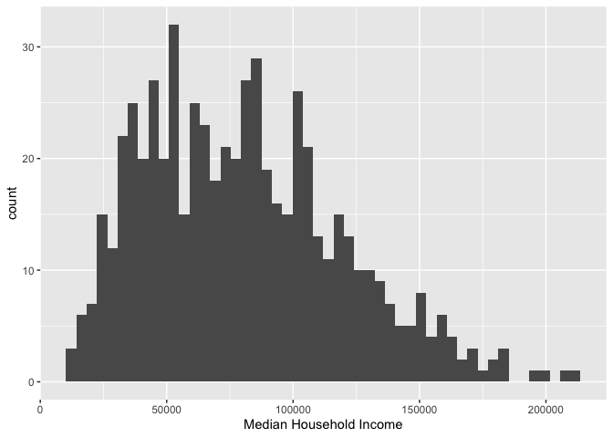
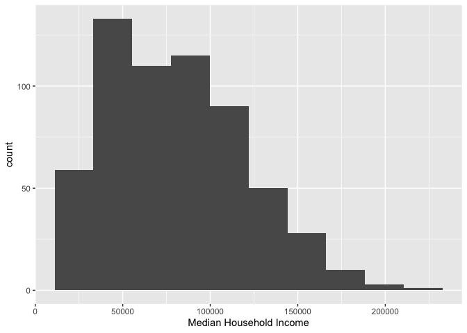
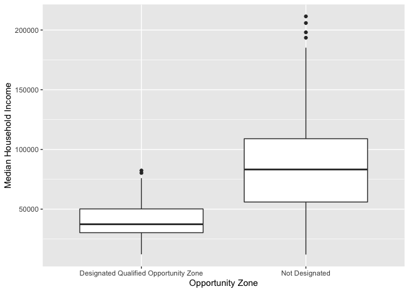
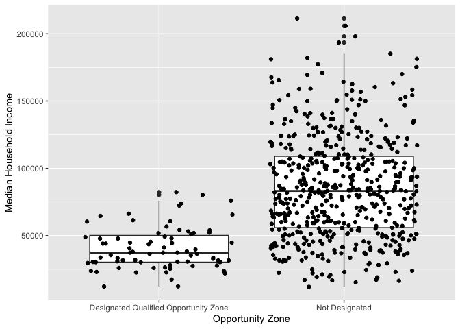
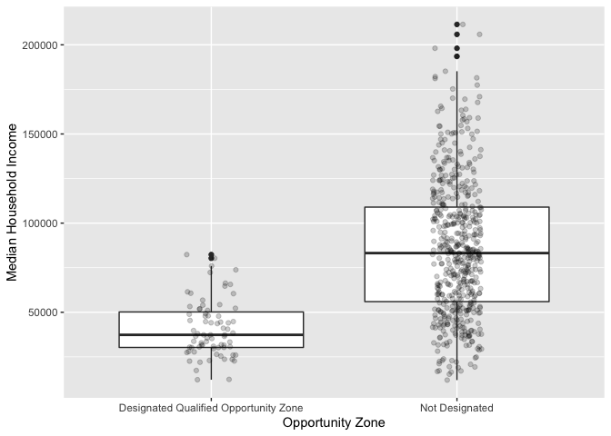
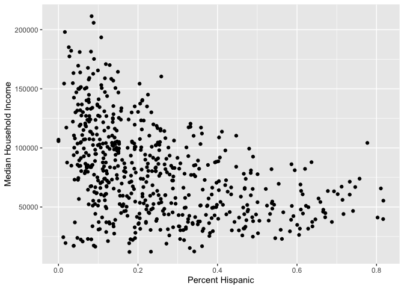

<style>
p.comment {
background-color: #DBDBDB;
padding: 10px;
border: 1px solid black;
margin-left: 25px;
border-radius: 5px;
font-style: italic;
}

.figure {
   margin-top: 20px;
   margin-bottom: 20px;
}

h1.title {
  font-weight: bold;
  font-family: Arial;  
}

h2.title {
  font-family: Arial;  
}

</style>


<style type="text/css">
#TOC {
  font-size: 13px;
  font-family: Arial;
}
</style>


\


In [Lab 2](https://crd150.github.io/lab2.html), we worked with county-level data.  That is, the rows or units of observations in our data set represented counties.  In this lab, we will be working with neighborhood data, using census tracts to represent neighborhoods.  The broader goal, however, is to acquire skills in running descriptive statistics and creating graphs using R. Make sure you've read and fully understood Handout 3 as this guide tracks closely with the material presented there. This lab's data were downloaded from [PolicyMap](https://ucdavis.policymap.com/maps).  The objectives of the guide are as follows

1. Get familiar with Census tract data
2. Learn how to use various R functions to summarize neighborhood characteristics
3. Introduction to R graphics

This lab guide follows closely and supplements the material presented in Chapters 1,3, 5 and 22 in the textbook [R for Data Science](http://r4ds.had.co.nz/index.html) (RDS) and the class Handout 3.

<p class="comment", style="font-style:normal">**Assignment 3 is due by 11:59 pm, January 30th on Canvas.**  See [here](https://crd150.github.io/hw_guidelines.html) for assignment guidelines.  You must submit an `.Rmd` file and its associated `.html` file. Name the files: yourLastName_firstInitial_asgn03. For example: brazil_n_asgn03.</p>

<div style="margin-bottom:25px;">
</div>
## **Open up a R Markdown file**
\

Download the [Lab template](https://raw.githubusercontent.com/crd150/data/master/labtemplate.Rmd) into an appropriate folder on your hard drive (preferably, a folder named 'Lab 3'), open it in R Studio, and type and run your code there.  Change the title ("Lab 3") and insert your name and date. Don't change anything else inside the YAML (the stuff at the top in between the `---`).  Also keep the grey chunk after the YAML. For a rundown on the use of R Markdown in labs, see [Lab 1](https://crd150.github.io/lab1.html)

<div style="margin-bottom:25px;">
</div>
## **Installing and loading packages**
\

You’ll need to install the following package in R. You only need to do it once, so if you’ve already installed this package, skip the code. Also, don’t put the `install.packages()` command in your R Markdown document. Copy and paste the code in the R Console. We’ll talk about what this package provides as its relevant functions come up in the guide.


```r
install.packages("GGally")
```

Next, load the required packages using `library()`. Remember, you need to do this every time you run an R session, so the following code should appear at the top of your R Markdown file.


```r
library(tidyverse)
library(GGally)
```


<div style="margin-bottom:25px;">
</div>
## **Reading in census tract data**
\

You will be working with census tract data for the cities of Sacramento, San Francisco, San Jose, and Oakland, the four largest cities in Northern California.  Let's get some practice working with data from PolicyMap, which provides Census data along with other cool and interesting neighborhood data.  

Unlike the Census, PolicyMap does not have a user-friendly R package for downloading their data through an API.  To save us time, I downloaded data from PolicyMap, cleaned the file, and uploaded it on GitHub. Let's bring the csv file into R using `read_csv()`.


```r
ncal.tracts <- read_csv("https://raw.githubusercontent.com/crd150/data/master/pmap_lab3.csv")
ncal.tracts
```

The dataset contains tract-level median household income, percent Hispanic, percent Black, whether the tract is designated as an [Opportunity Zone](http://dof.ca.gov/Forecasting/Demographics/opportunity_zones/) (a high-poverty neighborhood eligible for federal economic development funding), the home mortgage loan-to-income ratio (also known as the [leverage ratio](https://www.citylab.com/equity/2015/11/the-housing-boom-is-not-a-bubble/417966/)), and whether the tract is "Majority" Hispanic (*phisp* > 50%) or "Not Majority" Hispanic.  In putting this data file together, data wrangling was fairly extensive.  I've uploaded a [tutorial](https://crd150.github.io/policymap.html) describing the steps for downloading and cleaning these data.  The tutorial also provides a brief introduction to downloading data from PolicyMap.  You won't need to go through the tutorial to complete this guide and Assignment 3, but please look through it at some point as it provides some important data wrangling functions that will be relevant for your final project, especially if you are planning to use PolicyMap data.

<br>

Another mini lab tutorial that is important to look through (but not required for this lab or the homework) goes through how to detect and deal with [missing data](https://crd150.github.io/missingdata.html). Recall from Handout 2 the importance of missing data in the Data Wrangling process.  I've cleaned this week's data for you so you won't have to deal with missingness, but I recommend taking a look at the missing data mini lab at some point in the near future because you will encounter missing data in future labs, assignments and potentially in your final project.

<div style="margin-bottom:25px;">
</div>
## **Summarizing a single variable**
\

Recall from Handout 1 our two important data types: categorical and numeric. Let's first summarize a numeric variable - neighborhood median household income - using some basic descriptive statistics.

<div style="margin-bottom:25px;">
</div>
### **Numeric variables**
\

We can use the function `summarize()` to calculate mean neighborhood income.  The first argument inside `summarize()` is the data object *ncal.tracts* and the second argument is the function calculating the specific summary statistic, in this case `mean()`, which unsurprisingly calculates the mean of the variable you indicate in between the parentheses.


```r
summarize(ncal.tracts, mean(medincome))
```

```
## # A tibble: 1 x 1
##   `mean(medincome)`
##               <dbl>
## 1            80309.
```

Does the average neighborhood income differ by city?  We need to pair `summarize()` with the function `group_by()` to answer this question.  The function `group_by()` tells R to run subsequent functions on the data object *by* a group characteristic (such as gender, educational attainment, or in this case, city). Let's use our new best friend `%>%`, who we met and hugged in [Lab 2](https://crd150.github.io/lab2.html), to accomplish this task.


```r
ncal.tracts %>%
  group_by(city) %>%
  summarize(mean(medincome))
```

```
## # A tibble: 4 x 2
##   city          `mean(medincome)`
##   <chr>                     <dbl>
## 1 Oakland                  66706.
## 2 Sacramento               53562.
## 3 San Francisco            90985.
## 4 San Jose                 91464.
```

The utility of `%>%` is that it executes tasks on the same dataset using one line of continuous code. The first pipe sends *ncal.tracts* into the function *group_by()*, which tells R to group *ncal.tracts* by the variable *city*.  


```r
ncal.tracts %>%
  group_by(city)
```

How do you know the tibble is grouped? Because it tells you 

<center>


</center>

The second pipe takes this grouped dataset and sends it into the `summarize()` command, which calculates the mean neighborhood income (by city, because the dataset is grouped by city).

We can calculate more than one summary statistic within `summarize()`.  For example, to get the mean, median, standard deviation and interquartile range (IQR) of median income, and give column labels for the variables in the resulting summary table, we type in


```r
ncal.tracts %>%
  group_by(city) %>%
  summarize(incmn = mean(medincome),
            incmd = median(medincome),
            incsd = sd(medincome),
            inciqr = IQR(medincome))
```

```
## # A tibble: 4 x 5
##   city           incmn  incmd  incsd inciqr
##   <chr>          <dbl>  <dbl>  <dbl>  <dbl>
## 1 Oakland       66706. 51691  41262. 42011 
## 2 Sacramento    53562. 48696. 24405. 28392.
## 3 San Francisco 90985. 88929  38443. 50490 
## 4 San Jose      91464. 87917  34637. 48539
```

<br>

Remember from Handout 3 that the IQR is the difference between the 75th and 25th percentiles.  It is a measure of spread, and more generally, an indicator of inequality.  Another measure of neighborhood inequality is the 90/10 ratio. To calculate this ratio, we'll first need to calculate the 90th and 10th percentiles using the `quantile()` command. We can do all of this inside `summarize()`. Make sure you understand what each function in the code below is doing. 


```r
ncal.tracts %>%
  group_by(city) %>%
  summarize(incmn = mean(medincome),
            incmd = median(medincome),
            incsd = sd(medincome),
            inciqr = IQR(medincome),
            p90 = quantile(medincome, p = 0.90),
            p10 = quantile(medincome, p = 0.10),
            r90.10 = p90/p10) %>%
  select(-(c(p90,p10)))
```

```
## # A tibble: 4 x 6
##   city           incmn  incmd  incsd inciqr r90.10
##   <chr>          <dbl>  <dbl>  <dbl>  <dbl>  <dbl>
## 1 Oakland       66706. 51691  41262. 42011    4.38
## 2 Sacramento    53562. 48696. 24405. 28392.   3.14
## 3 San Francisco 90985. 88929  38443. 50490    3.56
## 4 San Jose      91464. 87917  34637. 48539    2.74
```


<div style="margin-bottom:25px;">
</div>
### **Categorical variables**
\

Let's next summarize a categorical variable.  *oppzone* indicates whether a tract is designated as an [Opportunity Zone](https://opzones.ca.gov/) neighborhood. The variable has two categories: designated and not designated as an Opportunity Zone. To get the percent of tracts that are Opportunity Zone neighborhoods, you'll need to combine the functions `group_by()`, `summarize()` and `mutate()` using `%>%`.


```r
ncal.tracts %>%
  group_by(oppzone) %>%
  summarize(n = n()) %>%
  mutate(freq = n / sum(n))
```

```
## # A tibble: 2 x 3
##   oppzone                                   n  freq
##   <chr>                                 <int> <dbl>
## 1 Designated Qualified Opportunity Zone    75 0.125
## 2 Not Designated                          524 0.875
```

Let's break up this chunk of code to show exactly what was done here. First, *ncal.tracts* was piped into the `group_by()` function.  Next, `group_by(oppzone)` separates the neighborhoods by Opportunity Zone designation. We then used `summarize()` to count the number of neighborhoods by Opportunity Zone designation.  The function to get a count is `n()`, and we saved this count in a variable named *n*. This gave us the following table.


```r
ncal.tracts %>%
  group_by(oppzone) %>%
  summarize (n = n())
```

```
## # A tibble: 2 x 2
##   oppzone                                   n
##   <chr>                                 <int>
## 1 Designated Qualified Opportunity Zone    75
## 2 Not Designated                          524
```

There are 75 neighborhoods that are designated as an Opportunity Zone. Next, this table is piped into  `mutate()`, which creates a variable showing the proportion of all neighborhoods by Opportunity Zone designation. The code `sum(n)` adds the values of *n*:  524+75 = 599. We then divide the value of each *n* by this sum:  75/599 = 0.125 and 524/599 = 0.875. That yields the final frequency table. 


```r
ncal.tracts %>%
  group_by(oppzone) %>%
  summarize (n = n()) %>%
  mutate(freq = n / sum(n))
```

```
## # A tibble: 2 x 3
##   oppzone                                   n  freq
##   <chr>                                 <int> <dbl>
## 1 Designated Qualified Opportunity Zone    75 0.125
## 2 Not Designated                          524 0.875
```

  
We can add *city* to the `group_by()` function to disaggregate the above results by city.  


```r
ncal.tracts %>%
  group_by(city, oppzone) %>%
  summarize (n = n()) %>%
  mutate(freq = n / sum(n))
```

```
## # A tibble: 8 x 4
## # Groups:   city [4]
##   city          oppzone                                   n   freq
##   <chr>         <chr>                                 <int>  <dbl>
## 1 Oakland       Designated Qualified Opportunity Zone    30 0.265 
## 2 Oakland       Not Designated                           83 0.735 
## 3 Sacramento    Designated Qualified Opportunity Zone    23 0.23  
## 4 Sacramento    Not Designated                           77 0.77  
## 5 San Francisco Designated Qualified Opportunity Zone    11 0.0558
## 6 San Francisco Not Designated                          186 0.944 
## 7 San Jose      Designated Qualified Opportunity Zone    11 0.0582
## 8 San Jose      Not Designated                          178 0.942
```
 
Which city has the highest proportion of Opportunity Zone neighborhoods? Lowest? 

<div style="margin-bottom:25px;">
</div>
## **Summarizing two variables**
\

The functions we've gone through so far describe **one** variable. It is often the case that we are interested in understanding whether two variables are associated with one another. 

Let's go through the ways we can describe the association between: (1) two categorical variables; (2) one categorical variable and one numeric variable; and (3) two numeric variables.

<div style="margin-bottom:25px;">
</div>
### **Two categorical variables**
\

To summarize the relationship between two categorical variables, you'll need to find the proportion of observations for each combination, also known as a cross tabulation. Let's create a cross tabulation of the categorical variables *oppzone* and *mhisp*. 


```r
ncal.tracts %>%
  group_by(oppzone, mhisp) %>%
  summarize(n = n())  %>%
  mutate(freq = n / sum(n))
```

```
## # A tibble: 4 x 4
## # Groups:   oppzone [2]
##   oppzone                               mhisp            n   freq
##   <chr>                                 <chr>        <int>  <dbl>
## 1 Designated Qualified Opportunity Zone Majority        16 0.213 
## 2 Designated Qualified Opportunity Zone Not Majority    59 0.787 
## 3 Not Designated                        Majority        47 0.0897
## 4 Not Designated                        Not Majority   477 0.910
```

A much higher proportion of Opportunity Zone neighborhoods are Majority Hispanic (0.213) compared to non Opportunity Zone neighborhoods (0.0897).

<div style="margin-bottom:25px;">
</div>
### **One categorical, one numeric**
\

A typical way of summarizing the relationship between a categorical variable and a numeric variable is by taking the mean of the continuous variable for each level of the categorical variable. We can get the mean loan-to-income ratio for neighborhoods designated and not designated as an Opportunity Zone using the following code.


```r
ncal.tracts %>%
  group_by(oppzone) %>%
  summarize("Mean levratio" = mean(levratio))
```

```
## # A tibble: 2 x 2
##   oppzone                               `Mean levratio`
##   <chr>                                           <dbl>
## 1 Designated Qualified Opportunity Zone            3.45
## 2 Not Designated                                   3.36
```

Let's separate by city by adding *city* to the `group_by()` function.


```r
ncal.tracts %>%
  group_by(city, oppzone) %>%
  summarize("Mean levratio" = mean(levratio))
```

```
## # A tibble: 8 x 3
## # Groups:   city [4]
##   city          oppzone                               `Mean levratio`
##   <chr>         <chr>                                           <dbl>
## 1 Oakland       Designated Qualified Opportunity Zone            3.46
## 2 Oakland       Not Designated                                   3.30
## 3 Sacramento    Designated Qualified Opportunity Zone            3.20
## 4 Sacramento    Not Designated                                   2.99
## 5 San Francisco Designated Qualified Opportunity Zone            3.82
## 6 San Francisco Not Designated                                   3.36
## 7 San Jose      Designated Qualified Opportunity Zone            3.54
## 8 San Jose      Not Designated                                   3.53
```

Does any city stick out?

<div style="margin-bottom:25px;">
</div>
### **Two numeric variables**
\

You can summarize the relationship between two numeric variables with the correlation coefficient.  To calculate the correlation coefficient, use the function `cor()`.  The first two arguments in `cor()` are the two numeric variables you want to calculate the correlation for. Let's calculate the correlation between neighborhood income and percent race, and neighborhood loan-to-income ratio and percent race.  Group these correlations by city.


```r
ncal.tracts %>%
  group_by(city) %>%
  summarize(hisp_ratio = cor(levratio,phisp), 
            blk_ratio = cor(levratio,pblk),
            hisp_inc = cor(medincome,phisp),
            blk_inc = cor(medincome,pblk))
```

```
## # A tibble: 4 x 5
##   city          hisp_ratio blk_ratio hisp_inc blk_inc
##   <chr>              <dbl>     <dbl>    <dbl>   <dbl>
## 1 Oakland            0.607     0.269   -0.468  -0.488
## 2 Sacramento         0.410     0.411   -0.544  -0.484
## 3 San Francisco      0.337     0.194   -0.309  -0.344
## 4 San Jose           0.607    -0.221   -0.693  -0.229
```

How would you interpret these results?

<div style="margin-bottom:25px;">
</div>
## **Summarizing variables using graphs**
\

Another way of summarizing neighborhood variables and their relationships is through graphs and charts.  The main package for R graphing is **ggplot2** which is a part of the **tidyverse** package.  The graphing function is `ggplot()` and it takes on the basic template

<br>

````
ggplot(data = <DATA>) +
      <GEOM_FUNCTION>(mapping = aes(x, y)) +
      <OPTIONS>()
````
<br>

1. `ggplot()` is the base function where you specify your dataset using the `data = <DATA>` argument.

2. You then need to build on this base by using the plus operator `+` and `<GEOM_FUNCTION>()` where `<GEOM_FUNCTION>()` is a unique function indicating the type of graph you want to plot. Each unique function has its unique set of mapping arguments which you specify using the `mapping = aes()` argument.  Charts and graphs have an x-axis, y-axis, or both.  Check [this](https://rstudio.com/wp-content/uploads/2016/11/ggplot2-cheatsheet-2.1.pdf) ggplot cheat sheet for all possible geoms. 

3. `<OPTIONS>()` are a set of functions you can specify to change the look of the graph, for example relabelling the axes or adding a title.

Before we go through how to create the graphs described in Handout 3, let's first get a quick sense of how `ggplot()` works. Below is code that creates a histogram


```r
ggplot(ncal.tracts) + 
  geom_histogram(mapping = aes(x=medincome))
```

```
## `stat_bin()` using `bins = 30`. Pick better value with `binwidth`.
```

<!-- -->

*ncal.tracts* is `<DATA>`, `geom_histogram()` is the `<GEOM_FUNCTION>()`, and `x=medincome` is the variable in *ncal.tracts* we are graphing.  We don't specify a `y =` because a histogram is a one variable plot.


<div style="margin-bottom:25px;">
</div>
### **Bar charts**
\

Recall from Handout 3 that we use bar charts to summarize categorical variables.  Bar charts show either the number or frequency of each category.  To create a bar chart, use `geom_bar()` for `<GEOM_FUNCTION>()`.  Let's show a bar chart of *oppzone*. We can borrow from the code we used earlier to create our *oppzone* frequency table and pipe this table directly into `ggplot()`.  


```r
ncal.tracts %>% 
  group_by(oppzone) %>%
  summarize (n = n()) %>%
  mutate(freq = n / sum(n))  %>%
  ggplot() +
    geom_bar(mapping=aes(x=oppzone, y=freq),stat="identity") 
```

<!-- -->
    
We didn't need to specify `data = <DATA>` in `ggplot()` because it was piped in.  Within `aes()`, we specified the categorical variable *oppzone* on the x-axis and then the proportion of neighborhoods *freq* on the y-axis.  The argument `stat = "identity"` tells `ggplot()` to plot the exact value listed for the variable *freq*.  

The X and Y axes labels are not so great. Remember from the Hoffman chapters, interpretable labels are important for getting your message clearly across.  We can relabel the axes using the `xlab()` and `ylab()` functions, which are examples of `<OPTIONS>()` functions.


```r
ncal.tracts %>% 
  group_by(oppzone) %>%
  summarize (n = n()) %>%
  mutate(freq = n / sum(n))  %>%
  ggplot() +
    geom_bar(mapping=aes(x=oppzone, y=freq),stat="identity") +
    xlab("Opportunity Zone") +
    ylab("Proportion")
```

<!-- -->
    
We can also show a cross tabulation of two categorical variables using a bar chart.  Let's take the earlier code used to create the cross tabulation of Opportunity Zone and Majority/Not Majority Hispanic and pipe that into `ggplot()`


```r
ncal.tracts %>% 
  group_by(oppzone, mhisp) %>%
  summarize(n = n())  %>%
  mutate(freq = n / sum(n)) %>%
  ggplot() +
    geom_bar(mapping=aes(x=oppzone,y=freq,fill=mhisp), position="dodge",stat="identity") +
    xlab("Opportunity Zone") +
    ylab("Frequency") +
    labs(fill="Hispanic Population") 
```

<!-- -->

The only real difference between the code to create this chart and the code to create the single variable bar chart is that you add the second categorical variable *mhisp* into the argument `fill=` within `aes()`.  The argument `position="dodge"` puts the bars side-by-side rather than stacked (take out `position="dodge"` from the above code and see what a stacked bar chart looks like. Ugly, right?). The above code also changes the legend title using the `<OPTIONS>()` function `labs()`. You can also add a title, subtitle and footnotes within the `labs()` function.


<div style="margin-bottom:25px;">
</div>
### **Histograms**
\

Histograms are used to summarize a single numeric variable.  To create a histogram, use `geom_histogram()` for `<GEOM_FUNCTION()>`.  Let's create a histogram of median household income.


```r
ggplot(ncal.tracts) + 
  geom_histogram(mapping = aes(x=medincome)) +
  xlab("Median Household Income") 
```

```
## `stat_bin()` using `bins = 30`. Pick better value with `binwidth`.
```

<!-- -->


As described earlier, because a single variable is plotted on the x-axis, we specify `x =` in `aes()` but not a `y = `.   

The message before the plot tells us that we can use the `bins =` argument to change the number of bins used to produce the histogram.  You can increase the number of bins to make the bins narrower and thus get a finer grain of detail.  Let's increase the number of bins from 30 (the default) to 50.


```r
ggplot(ncal.tracts) + 
  geom_histogram(mapping = aes(x=medincome), bins = 50)+
  xlab("Median Household Income") 
```

<!-- -->

Or you can decrease the number of bins to get a broader visual summary of the shape of the variable's distribution. Let's decrease the number of bins to 10.


```r
ggplot(ncal.tracts) + 
  geom_histogram(mapping = aes(x=medincome), bins = 10)+
  xlab("Median Household Income") 
```

<!-- -->

<div style="margin-bottom:25px;">
</div>
### **Boxplots**
\

We can use a boxplot to visually summarize the distribution of a single variable or the relationship between a categorical and numeric variable.  Use `geom_boxplot()` for `<GEOM_FUNCTION()>` to create a boxplot.  Let's examine median household income.   


```r
ggplot(ncal.tracts) +
     geom_boxplot(mapping = aes(y = medincome))+
    ylab("Median Household Income") 
```

<!-- -->

Remember from Handout 3 that the points outside the whiskers represent outliers. Outliers are defined as having values that are either larger than the 75th percentile plus 1.5 times the IQR or smaller than the 25th percentile minus 1.5 times the IQR.  The IQR is $55,103, the 75th percentile is $104,670 and the 25th percentile is $49,568.  While we don't see outliers at the bottom, we do see outliers at the top - these are neighborhoods with median income values greater than $104,670 + 1.5*$55,103 = $187,324.5

Let's examine the distribution of median income by Opportunity Zone. Because we are examining the association between two variables, we need to specify *x* **and** *y* variables.  


```r
ggplot(ncal.tracts) +
    geom_boxplot(mapping = aes(x = oppzone, y = medincome)) +
    xlab("Opportunity Zone") +
    ylab("Median Household Income") 
```

<!-- -->

Let’s add all the data points so you can see how the boxplots are summarizing the data. 


```r
ggplot(ncal.tracts) +
  geom_boxplot(mapping = aes(x = oppzone, y = medincome)) +
  geom_point(aes(x = oppzone, y = medincome)) +
    xlab("Opportunity Zone") +
    ylab("Median Household Income") 
```

<!-- -->

The straight vertical line of points is ugly, right? Let's jitter them a bit by using `geom_jitter()` rather than `geom_point()` 


```r
ggplot(ncal.tracts) +
  geom_boxplot(mapping = aes(x = oppzone, y = medincome)) +
  geom_jitter(aes(x = oppzone, y = medincome)) +
    xlab("Opportunity Zone") +
    ylab("Median Household Income") 
```

<!-- -->

Still ugly because the points are blocking the boxes and are spread out a bit too much.  Let's make the points more opaque and limit how far the points can go above and to the side from the vertical line.


```r
ggplot(ncal.tracts) +
  geom_boxplot(mapping = aes(x = oppzone, y = medincome)) +
  geom_jitter(aes(x = oppzone, y = medincome), position = position_jitter(width = 0.1, height = 0), alpha = 1/5) +
    xlab("Opportunity Zone") +
    ylab("Median Household Income") 
```

<!-- -->

<br>

[Beautiful](https://www.youtube.com/watch?v=eAfyFTzZDMM). The argument `position` within `geom_jitter()` provides how R should place the points. `width` specifies how far left and right the points will be jittered, `height` specifies how far above and below the points will be jittered, and `alpha` specifies how light (dark) the points should be.

The boxplot is for all neighborhoods combined.  We can use the `facet_wrap()`function to separate by city      
        

```r
ggplot(ncal.tracts) +
  geom_boxplot(mapping = aes(x = oppzone, y = medincome)) +
  xlab("Opportunity Zone") +
  ylab("Median Household Income") +
  facet_wrap(~city) 
```

<!-- -->

Note the tilde operator `~` before city.  

The labels for *oppzone* is really long.  We can change the label names (as an exercise, try this on your own) or we can create horizontal boxplots.  To create horizontal boxplots, add the `coord_flip()` function at the end.  Let's also change the axes labels to make them more descriptive (remember the Hoffman chapters regarding presentable graphics).


```r
ggplot(ncal.tracts) +
    geom_boxplot(mapping = aes(x = oppzone, y = medincome)) +
    facet_wrap(~city) +
    ylab("Median Household Income") +
    xlab("Opportunity Zone") +
    coord_flip()
```

<!-- -->

<div style="margin-bottom:25px;">
</div>
### **Scatterplots**
\

The scatterplot is the traditional graph for visualizing the association between two continuous variables. For scatterplots, we use `geom_point()` for `<GEOM_FUNCTION>()`. Because we are plotting two variables, we specify an *x* and *y* variable. Does median household income change with greater percent Hispanic in the neighborhood?


```r
ggplot(ncal.tracts) +
    geom_point(mapping = aes(x = phisp, y = medincome)) +
    xlab("Percent Hispanic") +
    ylab("Median Household Income")
```

<!-- -->

And for each city?


```r
ggplot(ncal.tracts) +
    geom_point(mapping = aes(x = phisp, y = medincome)) +
    xlab("Percent Hispanic") +
    ylab("Median Household Income") +
    facet_wrap(~city) 
```

<!-- -->

<br>

What do these scatter plots suggest about the relationship between income and percent Hispanic across these four cities?

`ggplot()` is a powerful function, and you can make a lot of really visually captivating graphs. You can also make maps with the function, which we'll cover in next week's lab.  We have just scratched the surface of its functions and features.  The list of all possible plots for `<GEOM_FUNCTION>()` can be found [here](https://ggplot2.tidyverse.org/reference/).  You can also make your graphs really "pretty" and professional looking by altering graphing features using `<OPTIONS()`, including colors, labels, titles and axes.  For a list of `ggplot()` functions that alter various features of a graph, check out [Chapter 22 in RDS](http://r4ds.had.co.nz/graphics-for-communication.html).  

<div style="margin-bottom:25px;">
</div>
### **Scatter plot matrices**
\

What if you wanted to summarize the relationship between multiple variables in one graphic?  A scatter plot matrix can do that.  This plot visualizes the bivariate relationships among several pairs of variables. The individual scatter plots are stacked such that each variable is in turn on the x-axis and on the y-axis.

The `ggpairs()` function, which is a part of the **GGally** package, creates scatter plot matrices.  Let's produce one for the variables *levratio*, *medincome*, *phisp*, and *pblk*.


```r
ggpairs(ncal.tracts, columns = c("levratio", "medincome", "phisp", "pblk"), 
        diag=list(continuous="barDiag"))
```

<!-- -->

<br>

The plot shows a lot of information in a concise and compact presentation.  The diagonal shows histograms of each variable, which we specify in the code using the argument `diag=list(continuous="barDiag")`.  The upper diagonal shows the correlation between the variables indicated by the column and row labels.  For example, the correlation between percent black and median household income is -0.442.  The lower diagonal shows scatterplots.


<div style="margin-bottom:25px;">
</div>
## **Assignment 3**
\

Assignment 3 will be posted here on Friday.

***


Website created and maintained by [Noli Brazil](https://nbrazil.faculty.ucdavis.edu/)
